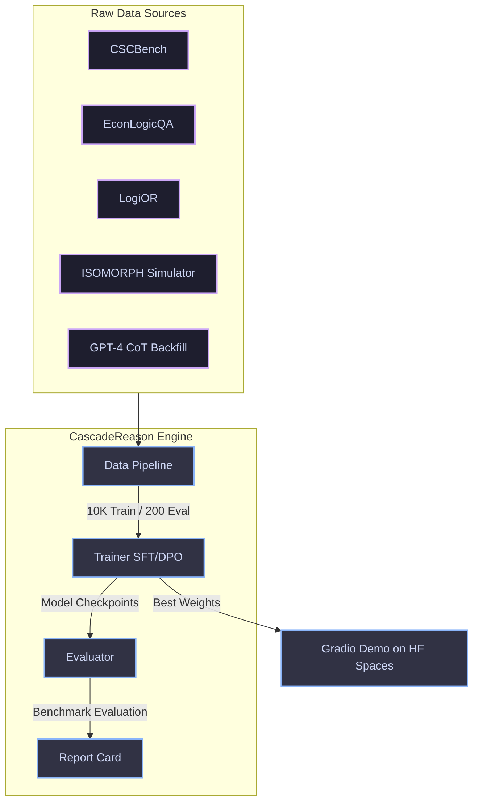
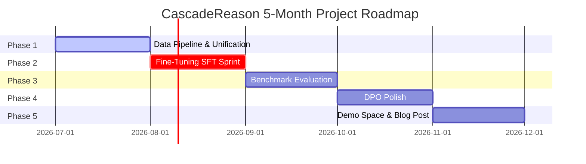

# CascadeReason 🧠⛓️💥

> Reasoning through supply chain cascading failures with fine-tuned LLMs.

[](https://www.python.org/)
[](https://huggingface.co/)
[](https://www.kaggle.com/)
[](https://opensource.org/licenses/MIT)

---

## 🎯 The Problem

Supply chain disruptions cost the global economy hundreds of billions of dollars annually. A port closure, a supplier bankruptcy, or a cyberattack triggers a **cascading failure**—one delay compounds into another, rippling across continents.

While LLMs excel at generic Q&A, they typically fail at **multi-step causal reasoning under uncertainty**. They cannot reliably simulate how a 7-day port strike affects downstream inventory levels, production schedules, and customer satisfaction—let alone explain this reasoning step-by-step.

**CascadeReason** is a fine-tuned reasoning engine (based on Llama 3.2 3B) designed specifically to analyze supply chain disruption scenarios and output structured, multi-step causal reasoning chains.

---

## 🚀 Key Features

*   **Step-by-Step Causal Reasoning**: Outlines primary, secondary, and tertiary downstream impacts of a disruption.
*   **Quantitative Impact Predictions**: Predicts time-to-depletion and cost escalations.
*   **Actionable Mitigations**: Proposes and ranks feasible mitigation strategies.
*   **Confidence Scoring**: Provides calibrated confidence ratings per prediction.
*   **Constraint-Native Design**: Trained entirely using free Kaggle T4 GPUs (16GB VRAM) and streaming data setups.

---

## 🏗️ Architecture



---

## 🛠️ Constraint-First Design Philosophy

CascadeReason is engineered to demonstrate how production-grade LLM research can be shipped within strict resource limits (no local compute, ephemeral storage, and Kaggle's free T4 GPU quota).

| Constraint | Design Decision | Rationale |
| :--- | :--- | :--- |
| **16GB VRAM Limit** | Drop Full Fine-Tuning | Full FT of Llama 3.2 3B requires ~28GB VRAM; impossible on a single T4. |
| **16GB VRAM Limit** | LoRA & QLoRA Only | Adapters consume < 1GB VRAM, fitting easily within memory. |
| **16GB VRAM Limit** | Batch Size = 4 + Grad Accum = 4 | Simulates an effective batch size of 16 without OOMing. |
| **16GB VRAM Limit** | `bfloat16` + Gradient Checkpointing | Reduces training memory footprint by ~40%. |
| **40 hrs/week Quota** | Parallel Kaggle Sessions | Runs LoRA $r=8$ and $r=32$ runs concurrently on separate sessions. |
| **Ephemeral Disk** | Hugging Face Dataset Streaming | Stream datasets directly without downloading the full corpus to disk. |
| **Ephemeral Disk** | Immediate `push_to_hub()` | Pushes checkpoints directly to HF Hub and purges local weight caches. |

---

## 📈 Evaluation & Benchmarks (Report Card)

All models are evaluated on a **200-question hand-verified benchmark** (derived from CSCBench and simulator scenarios, ensuring 0% overlap with the training set).

| Method | Causal Coherence | Impact Accuracy | Hallucination Rate | Peak VRAM | Inference Speed |
| :--- | :---: | :---: | :---: | :---: | :---: |
| **Base Llama 3.2 3B** | 34% | 22% | 28% | **3 GB** | **15 ms/token** |
| **LoRA $r=8$** | *X%* | *X%* | *X%* | ~11 GB | 16 ms/token |
| **LoRA $r=32$** | *X%* | *X%* | *X%* | ~12 GB | 17 ms/token |
| **QLoRA (4-bit NF4)** | *X%* | *X%* | *X%* | **8 GB** | 18 ms/token |
| **LoRA $r=32$ + DPO** | *Y%* | *Y%* | *Y%* | ~12 GB | 17 ms/token |

*(Note: Metric percentages are filled during evaluation stages. Preliminary results show DPO reasoning coherence scaling from ~72% to ~86% over SFT checkpoints.)*

---

## 📂 Repository Structure

```text
cascade-reason/
├── notebooks/
│   ├── 01_data_pipeline.ipynb      # Dataset download, cleaning & formatting
│   ├── 02_train_lora_r8.ipynb      # Kaggle notebook for LoRA r=8 SFT
│   ├── 02_train_lora_r32.ipynb     # Kaggle notebook for LoRA r=32 SFT
│   ├── 02_train_qlora.ipynb        # Kaggle notebook for 4-bit QLoRA SFT
│   ├── 03_evaluate.ipynb           # Model evaluation on the 200-question benchmark
│   └── 04_dpo.ipynb                # Preference tuning (DPO) for reasoning coherence
├── scripts/
│   ├── generate_cot.py             # GPT-4o-mini chain-of-thought data backfilling
│   └── parse_results.py            # Result parser & metrics calculator
├── configs/
│   ├── lora_r8.yaml                # PEFT configuration for r=8
│   ├── lora_r32.yaml               # PEFT configuration for r=32
│   └── qlora.yaml                  # PEFT configuration for 4-bit QLoRA
├── data/
│   └── eval_benchmark.jsonl        # 200 hand-verified evaluation scenarios
├── outputs/
│   └── report_card.json            # Parsed metrics across model runs
├── requirements.txt                # Project dependencies
└── Readme.md                       # Project documentation
```

---

## 🏁 Roadmap & Phases



*   **Phase 1 (Data Pipeline)**: Unify CSCBench, EconLogicQA, LogiOR, and ISOMORPH simulator outputs. Use GPT-4o-mini to backfill high-quality CoT steps. Target: 10k training pairs.
*   **Phase 2 (The Kaggle Sprint)**: Execute LoRA $r=8$, $r=32$, and QLoRA fine-tuning runs using sequence packing and 8-bit AdamW.
*   **Phase 3 (Evaluation & Analysis)**: Generate predictions over the 200-question benchmark and build comparative visualization charts.
*   **Phase 4 (DPO Alignment)**: Use preference optimization on the best SFT model to boost coherence and reduce hallucinated supply chain nodes.
*   **Phase 5 (Deployment)**: Push models to Hugging Face Hub, host Gradio UI on Hugging Face Spaces, and publish the technical report.

---

## 🛠️ Installation & Setup

1.  **Clone the Repository**:
    ```bash
    git clone https://github.com/Aho-Bakaa/Cascade-Reason.git
    cd Cascade-Reason
    ```

2.  **Install Dependencies**:
    ```bash
    pip install -r requirements.txt
    ```

3.  **Run Pipeline**:
    *   Set up your environment variables (`HF_TOKEN` and `OPENAI_API_KEY`).
    *   Open and run the notebooks in `/notebooks` on Kaggle or your local environment.

---

## 📄 License

This project is licensed under the MIT License. See [LICENSE](LICENSE) for details.